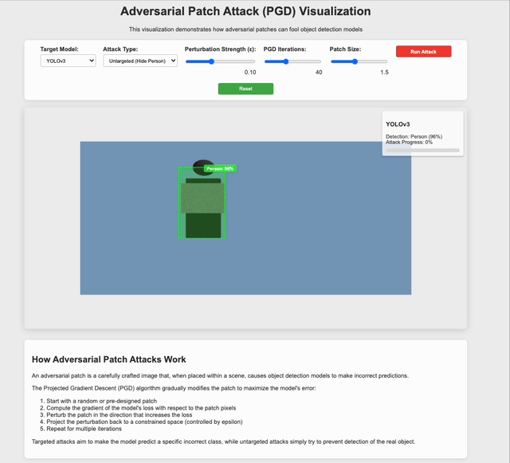

# Adversarial Patch Attack Visualization

An interactive 3D visualization demonstrating how adversarial patches can fool object detection models through localized noise patterns.



## What is an Adversarial Patch Attack?

Adversarial patch attacks are a form of adversarial attack that use localized, confined patterns of noise (a "patch") to manipulate neural network predictions. Unlike global adversarial examples that require pixel-level access to the entire image, patches can be:

- Printed and placed in the physical world
- Applied to small regions of an image or scene
- Used to attack computer vision systems from a distance

These attacks are particularly concerning for real-world AI systems because:
1. They don't require any access to the model itself (black-box attacks)
2. They can be deployed physically in the environment
3. They remain effective across different viewing angles, lighting conditions, and distances

## How Localized Noise Works in Adversarial Patches

Adversarial patches leverage carefully constructed patterns of noise confined to a specific region:

1. **Pixel Optimization**: Each pixel in the patch is systematically optimized to maximize the model's prediction error
2. **Transferability**: Well-designed patches can fool different models trained on similar data
3. **Exploitation of Feature Space**: Patches create patterns that strongly activate/deactivate specific neurons in the network

The noise isn't random—it's methodically crafted through optimization algorithms like Projected Gradient Descent (PGD) to gradually evolve toward patterns that either:
- Force the model to predict a specific incorrect class (targeted attack)
- Cause the model to miss detections entirely (untargeted attack)

## Technical Implementation

This visualization uses HTML5, JavaScript, and Three.js to create an interactive demonstration of adversarial patch attacks:

### Core Components

1. **3D Scene Rendering**:
   - Three.js creates a 3D environment with a person model, adversarial patch, and realistic object detection bounding box
   - Perspective camera and orbital controls allow for viewing from multiple angles

2. **PGD Attack Simulation**:
   - The patch starts with a randomized or structured initial texture
   - A frame-by-frame simulation of gradient-based optimization using a Canvas API implementation
   - Visual noise patterns evolve with configurable parameters (epsilon, iterations)

3. **Detection Visualization**:
   - Semi-transparent bounding box with colored edges shows detection state
   - Floating label displays class and confidence percentage
   - Color transitions from green (Person) to red (Truck) for targeted attacks
   - Opacity changes for untargeted attacks to visualize "disappearing" objects

4. **Interactive Controls**:
   - Attack parameters can be adjusted in real-time (perturbation strength, iterations, patch size)
   - Toggle between targeted and untargeted attacks
   - Model selection to simulate different object detectors (YOLOv3, YOLOv5, Faster R-CNN)
   - Start/pause functionality to examine the attack at specific stages

### Technical Highlights

- **Canvas-based Texture Generation**: Dynamically generates and updates adversarial patterns using HTML5 Canvas API
- **Realistic Detection Feedback**: Simulates how detection confidence changes during an attack
- **Slow-motion Animation**: Frame limiter ensures the attack progresses slowly enough to observe
- **Physically-based Rendering**: Realistic lighting and 3D models enhance educational value
- **Modular Design**: Separates attack algorithm, visualization, and UI components

## Running the Visualization

1. Clone this repository
2. Navigate to the repository directory
3. Run the server script:
```bash
./run_adversarial_patch.sh
```
4. Open your browser to [http://localhost:8000/adversarial_patch_attack.html](http://localhost:8000/adversarial_patch_attack.html)

## License

MIT 